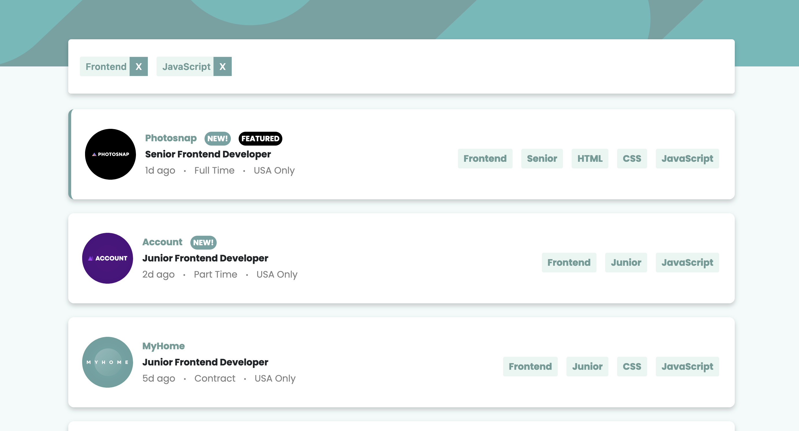

# Frontend Mentor - Job listings with filtering solution

This is a solution to the [Job listings with filtering challenge on Frontend Mentor](https://www.frontendmentor.io/challenges/job-listings-with-filtering-ivstIPCt). Frontend Mentor challenges help you improve your coding skills by building realistic projects. 

## Table of contents

- [Overview](#overview)
  - [The challenge](#the-challenge)
  - [Screenshot](#screenshot)
  - [Links](#links)
- [My process](#my-process)
  - [Built with](#built-with)
  - [What I learned](#what-i-learned)
  - [Useful resources](#useful-resources)
- [Author](#author)

## Overview

### The challenge

Users should be able to:

- View the optimal layout for the site depending on their device's screen size
- See hover states for all interactive elements on the page
- Filter job listings based on the categories

### Screenshot



### Links

- Live Site URL: [Vikas's Job Listing Page](https://vikas-frontend-mentor.netlify.app/job-listings)

## My process

### Built with

- CSS custom properties
- Tailwind CSS
- Flexbox
- Bootstrap Container
- CSS Media Queries
- [React](https://reactjs.org/) - JS library
- React state to manage filtering

### What I learned

- How to give a CSS effect of making a div appear to come out of the screen by providing it a box shadow.
```css
.job-component{
    box-shadow: 0 4px 8px 0 rgba(0,0,0,0.2);
}
.job-component:hover{
    box-shadow: 0 8px 16px 0 rgba(0,0,0,0.2); 
}
```
- Removing the image from the flow of the document and pushing it up to make half of it outside the card and half inside by using relative and absolute positioning.
```jsx
<div className='relative col-md-6 ps-md-4 col-12 mt-4 mb-4 h-100 flex items-center'>
    <div className='logo'>
        
    </div>
</div>
```
```scss
@media screen and (min-width:1px) and (max-width : 768px){
    .logo {
        position: absolute;
        width: 50px;
        top: -60px;
        left: 20px;
        .logo-img {
            width: 100%;
        }
    }
}
```

### Useful resources

- [w3schools](https://www.w3schools.com/) - Helped me with the CSS code to be added to provide the 'coming out of the screen' effect to a div.
- [Tailwind CSS](https://tailwindcss.com/) - This helped me in applying certain flexbox and text aligning styles without defining separate classes.
- [Bootstrap](https://getbootstrap.com/docs/5.0/layout/containers/) - This helped me in understanding the grid system which helped in creating the responsive mobile design, as well as making the navbar of the site.


## Author

- Frontend Mentor - [@LieutPaul](https://www.frontendmentor.io/profile/LieutPaul)
- Twitter - [@VKas_17](https://twitter.com/VKas_17)
