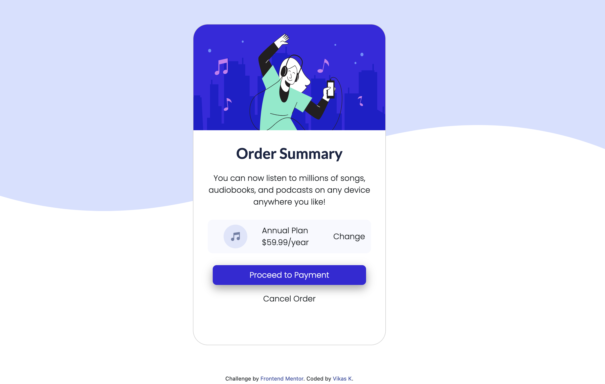

# Frontend Mentor - Order summary card solution

This is a solution to the [Order summary card challenge on Frontend Mentor](https://www.frontendmentor.io/challenges/order-summary-component-QlPmajDUj). Frontend Mentor challenges help you improve your coding skills by building realistic projects. 

## Table of contents

- [Overview](#overview)
  - [The challenge](#the-challenge)
  - [Screenshot](#screenshot)
  - [Links](#links)
- [My process](#my-process)
  - [Built with](#built-with)
  - [Useful resources](#useful-resources)
- [Author](#author)

## Overview

### The challenge

Users should be able to:

- See hover states for interactive elements

### Screenshot

### Links

- Solution URL: [Add solution URL here](https://your-solution-url.com)
- Live Site URL: [Add live site URL here](https://vikas-frontend-mentor.netlify.app/)

## My process

### Built with

- CSS custom properties
- Flexbox
- Tailwind CSS
- Bootstrap grid System

### Useful resources

- [Tailwind CSS](https://tailwindcss.com/) - This helped me in applying certain flexbox and text aligning styles without defining separate classes.
- [Bootstrap](https://getbootstrap.com/docs/5.0/layout/containers/) - This helped me in understanding the grid system which helped in creating the responsive mobile design.

## Author

- Frontend Mentor - [@LieutPaul](https://www.frontendmentor.io/profile/LieutPaul)
- Twitter - [@VKas_17](https://twitter.com/VKas_17)
