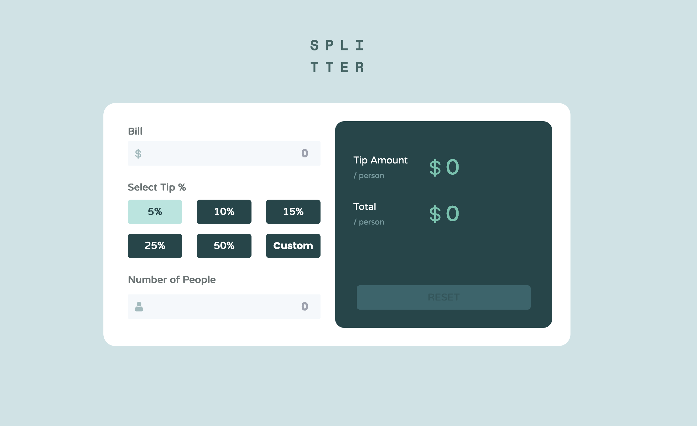

# Frontend Mentor - Tip calculator app solution

This is a solution to the [Tip calculator app challenge on Frontend Mentor](https://www.frontendmentor.io/challenges/tip-calculator-app-ugJNGbJUX). Frontend Mentor challenges help you improve your coding skills by building realistic projects.

## Table of contents

- [Overview](#overview)
  - [The challenge](#the-challenge)
  - [Screenshot](#screenshot)
  - [Links](#links)
- [My process](#my-process)
  - [Built with](#built-with)
  - [What I learned](#what-i-learned)
  - [Useful resources](#useful-resources)
- [Author](#author)

## Overview

### The challenge

Users should be able to:

- View the optimal layout for the app depending on their device's screen size
- See hover states for all interactive elements on the page
- Calculate the correct tip and total cost of the bill per person

### Screenshot

### Links

- Live Site URL: [Vikas's Tip Calculator](https://vikas-frontend-mentor.netlify.app/tip-calculator)

## My process

### Built with

- CSS custom properties
- Flexbox
- Tailwind CSS
- Bootstrap Grid
- [React](https://reactjs.org/) - JS library

### What I learned

- How to make a group of buttons and have only one selected using React State
- How to add images such as person's icon and dollar icon inside the input box
- Using the react icons Library

### Useful resources

- [Tailwind CSS](https://tailwindcss.com/) - This helped me in applying certain flexbox and text aligning styles without defining separate classes.
- [Bootstrap](https://getbootstrap.com/docs/5.0/layout/containers/) - This helped me in understanding the grid system which helped in creating the responsive mobile design.

## Author

- Frontend Mentor - [@LieutPaul](https://www.frontendmentor.io/profile/LieutPaul)
- Twitter - [@VKas_17](https://twitter.com/VKas_17)
